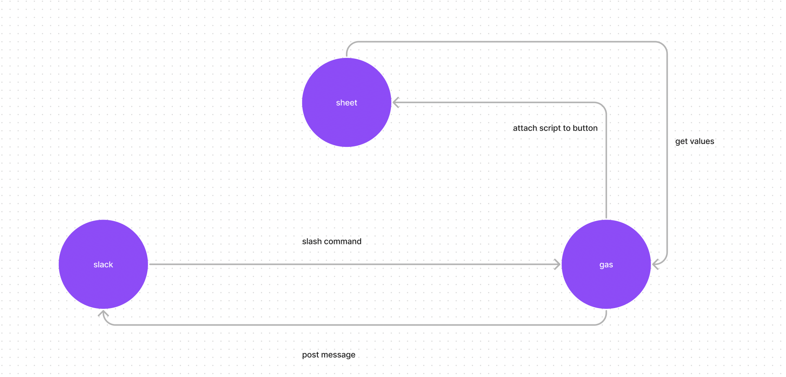
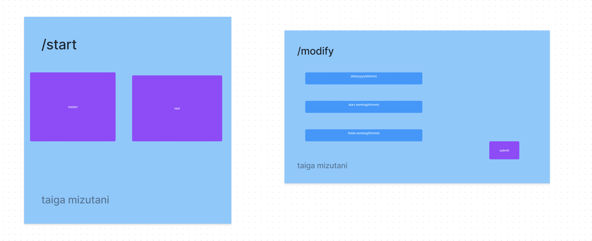

# Slack-punch

## 目的
- 1.ユーザーがSlack上で、業務の開始と終了を宣言できるようにします。
- 2.宣言された各時刻から就業時間を計算し、月次の勤怠表を出力する。

## 使用技術:
- Slack
    - slashコマンドによってユーザーの勤怠データを宣言をするUIを提供する
- Google Spreadsheets
    - ユーザーによって宣言されたrawデータを格納するlogシートを提供する
    - logシートのデータを元に勤怠を月次で管理するsummaryシートを提供する
- Google App Script
    - 格納されたデータに対して、数学的な操作を加える
    - slashコマンドのエンドポイントとしてAPIを提供する
    - Google Spreadsheetsにslashコマンドで宣言された変数を格納する操作を加える

## Slackコマンド:
- `/start`: 開始時刻をシートに記録し、特定のチャンネルに「休憩」および「再開」のボタンがあるメッセージを投稿します。
- `/modify`: ユーザーが終了/開始を忘れた場合、記録された開始と終了時刻を修正できます。

## シートの構造:
- ログシート:
  - 日々の開始と終了時刻を記録します。
- サマリーシート:
  - 労働時間の月次サマリーを提供します。

## 計算:
- 計算はクリックイベントでトリガーされます。
- 数学的な操作が実行され、労働時間が算出され、サマリーが提供されます。

### flow Image

### slack上でslashコマンドを実行した際に、表示されるUI

